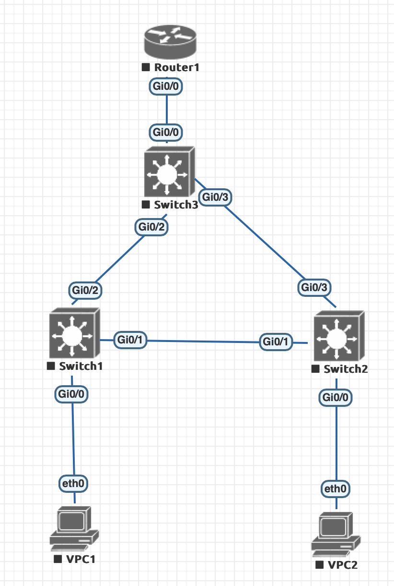

# Небольшая сеть офиса
### Топология


### Пинг
###### VPC2
```
VPC1> ping 10.0.20.111

84 bytes from 10.0.20.111 icmp_seq=1 ttl=63 time=13.759 ms
84 bytes from 10.0.20.111 icmp_seq=2 ttl=63 time=7.451 ms
84 bytes from 10.0.20.111 icmp_seq=3 ttl=63 time=6.870 ms
84 bytes from 10.0.20.111 icmp_seq=4 ttl=63 time=7.228 ms
84 bytes from 10.0.20.111 icmp_seq=5 ttl=63 time=7.577 ms
```
###### VPC1
```
VPC2> ping 10.0.10.111

84 bytes from 10.0.10.111 icmp_seq=1 ttl=63 time=6.795 ms
84 bytes from 10.0.10.111 icmp_seq=2 ttl=63 time=11.770 ms
84 bytes from 10.0.10.111 icmp_seq=3 ttl=63 time=7.642 ms
84 bytes from 10.0.10.111 icmp_seq=4 ttl=63 time=12.173 ms
84 bytes from 10.0.10.111 icmp_seq=5 ttl=63 time=7.891 ms
```
### Каждый клиент находится в своем VLAN
###### Конфиг Switch1
```
interface GigabitEthernet0/0
 no shutdown
 switchport access vlan 10
 switchport mode access
 negotiation auto
```
###### Конфиг Switch2
```
interface GigabitEthernet0/0
 no shutdown
 switchport access vlan 20
 switchport mode access
 negotiation auto
```
### Коммутатор уровня распределения является корнем сети для обоих VLAN
```
Switch3#show spanning-tree vlan 10

VLAN0010
  Spanning tree enabled protocol ieee
  Root ID    Priority    24586
             Address     5000.0005.0000
             This bridge is the root
             Hello Time   2 sec  Max Age 20 sec  Forward Delay 15 sec

  Bridge ID  Priority    24586  (priority 24576 sys-id-ext 10)
             Address     5000.0005.0000
             Hello Time   2 sec  Max Age 20 sec  Forward Delay 15 sec
             Aging Time  300 sec

Interface           Role Sts Cost      Prio.Nbr Type
------------------- ---- --- --------- -------- --------------------------------
Gi0/0               Desg FWD 4         128.1    P2p 
Gi0/2               Desg FWD 4         128.3    P2p 
Gi0/3               Desg FWD 4         128.4    P2p
```
```
Switch3#show spanning-tree vlan 20

VLAN0020
  Spanning tree enabled protocol ieee
  Root ID    Priority    24596
             Address     5000.0005.0000
             This bridge is the root
             Hello Time   2 sec  Max Age 20 sec  Forward Delay 15 sec

  Bridge ID  Priority    24596  (priority 24576 sys-id-ext 20)
             Address     5000.0005.0000
             Hello Time   2 sec  Max Age 20 sec  Forward Delay 15 sec
             Aging Time  300 sec

Interface           Role Sts Cost      Prio.Nbr Type
------------------- ---- --- --------- -------- --------------------------------
Gi0/0               Desg FWD 4         128.1    P2p 
Gi0/2               Desg FWD 4         128.3    P2p 
Gi0/3               Desg FWD 4         128.4    P2p
```
### Линк между коммутаторами уровня доступ должен стать заблокированным
```
Switch2#show spanning-tree vlan 20

VLAN0020
  Spanning tree enabled protocol ieee
  Root ID    Priority    24596
             Address     5000.0005.0000
             Cost        4
             Port        4 (GigabitEthernet0/3)
             Hello Time   2 sec  Max Age 20 sec  Forward Delay 15 sec

  Bridge ID  Priority    32788  (priority 32768 sys-id-ext 20)
             Address     5000.0004.0000
             Hello Time   2 sec  Max Age 20 sec  Forward Delay 15 sec
             Aging Time  300 sec

Interface           Role Sts Cost      Prio.Nbr Type
------------------- ---- --- --------- -------- --------------------------------
Gi0/0               Desg FWD 4         128.1    P2p 
Gi0/1               Altn BLK 4         128.2    P2p 
Gi0/3               Root FWD 4         128.4    P2p
```
### Cеть отказоустойчива. Отключение интерфейса не нарушает связанность между клиентами
```
Switch2#show spanning-tree vlan 20

VLAN0020
  Spanning tree enabled protocol ieee
  Root ID    Priority    24596
             Address     5000.0005.0000
             Cost        4
             Port        4 (GigabitEthernet0/3)
             Hello Time   2 sec  Max Age 20 sec  Forward Delay 15 sec

  Bridge ID  Priority    32788  (priority 32768 sys-id-ext 20)
             Address     5000.0004.0000
             Hello Time   2 sec  Max Age 20 sec  Forward Delay 15 sec
             Aging Time  300 sec

Interface           Role Sts Cost      Prio.Nbr Type
------------------- ---- --- --------- -------- --------------------------------
Gi0/0               Desg FWD 4         128.1    P2p 
Gi0/1               Desg FWD 4         128.2    P2p 
Gi0/3               Root FWD 4         128.4    P2p
```
Когда удаляется интерфейс Gi0/2, то пинг доходит так как разблокируется линк между Switch1 и Switch2
